# Thunderbird AI Mail Pipeline: Deep Dive

This is an implementation-level guide to the Thunderbird AI Mail Intelligence
pipeline in this checkout. It describes what happens to mail, where each piece
of data lives, what is deterministic versus model-assisted, how RAG works, and
when the configured Ollama endpoint is used.

It is deliberately more detailed than the UI. It is intended to make a
debugging session reproducible: an engineer or advanced user should be able to
follow a message from the mail store to its AI record, RAG passage, retrieved
evidence card, assistant answer, citation, or mailbox digest.

> **The most important distinction**: normal analysis and retrieval are local
> Thunderbird work. An Ollama request is used only for enabled endpoint-backed
> generation/embeddings, Assistant synthesis, or an explicit exhaustive
> scoped digest. Thunderbird never sends an entire mailbox as one prompt.

## 1. System at a glance

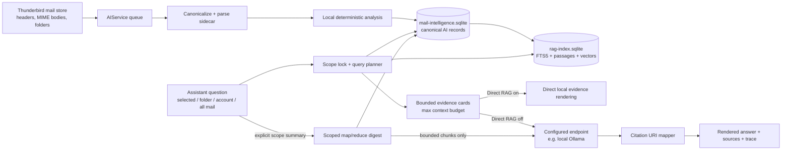

There are two profile-local databases with different responsibilities:

| Store | Role | Is it canonical? | Can it be rebuilt? |
|---|---|---:|---:|
| `ai/mail-intelligence.sqlite` | Per-message AI records, jobs, digest maps/digests, provider state, traces and other generated AI state | Yes | Not from the RAG index alone; it is the source for that index |
| `ai/rag-index.sqlite` | FTS5 passages, contextual chunks, vectors, scope-overview cache, index generation state | No | Yes, from canonical AI records |

The source code ownership map is:

| Module | Primary job |
|---|---|
| `AIService.sys.mjs` | Queueing, message reading, local analysis, endpoint-backed optional work, digest jobs, UI runtime state |
| `AIClassifier.sys.mjs` | Built-in category heuristics, local summaries, basic entities and tags |
| `AIExtractionRules.sys.mjs` | Structured transaction/reference/amount/date rules and optional endpoint extraction helper |
| `AIPIIRules.sys.mjs` | Deterministic PII matching, redaction policy and custom rules |
| `AIRAGIndex.sys.mjs` | Contextual child passages, SQLite/FTS5 index, dense-vector lookup and scope overview cache |
| `AIChat.sys.mjs` | Scope binding, query planning, hybrid retrieval, evidence packing, endpoint synthesis and citation mapping |
| `AIStorage.sys.mjs` / `AISQLiteStorage.sys.mjs` | Canonical state API, row-level persistence, bulk checkpoints and recovery |
| `AIEndpoint.sys.mjs` / `AISources.sys.mjs` | Saved sources, endpoint policy, requests, retries, cancellation and health |
| `AISafety.sys.mjs` | Local security assessment using parse artifacts and mail-derived evidence |

## 2. Local versus endpoint work

The word “AI” covers several different techniques in this product. They must
not be confused.

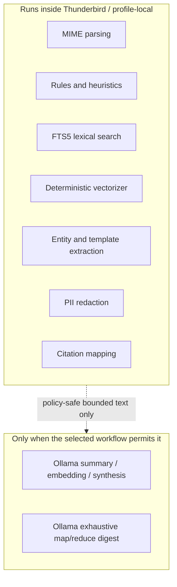

### 2.1 Always-local work

The following work is local regardless of whether an endpoint is configured:

- Reading message headers and MIME-rendered body text.
- Choosing the canonical body and preserving parser/trust sidecar metadata.
- Category heuristics and tags.
- Regex/template extraction.
- Deterministic security assessment.
- Deterministic PII matching and redaction decisions.
- FTS5 lexical indexing and local contextual-passage embeddings.
- Exact identifier, amount and date constraint filtering.
- Scope filtering, evidence budgets, and citation mapping.
- SQLite persistence, recovery, backfill bookkeeping and UI status.

### 2.2 Local category routing is not a bundled LLM

The built-in category lane is named `Sparse Naive Bayes Categories` and its
engine is `multinomial-naive-bayes`. It is a size-`0 MB` local routing helper,
not a downloaded ONNX/GGUF model, does not start a separate model server, and
does not use a GPU.

Its base behavior is rule/heuristic classification. For example, terms such as
`invoice`, `receipt`, `payment`, `bank`, or `statement` contribute to a finance
category; `job alert` contributes to jobs; `password` or `2fa` contributes to
security.

There is an optional, locally trained token-statistics classifier. When a user
has supplied labelled examples, Thunderbird can rebuild local per-label token
counts and score new text against them. It is used only after no exact rule or
user-template override applies. Its output is routing metadata and can never
be cited as mailbox evidence.

### 2.3 When an endpoint is used

The endpoint can be a loopback Ollama URL such as
`http://127.0.0.1:11434/v1/chat/completions`. If so, the Ollama server and its
model are separate local processes; Thunderbird is the client.

| Operation | Endpoint needed? | Gate |
|---|---:|---|
| Normal deterministic analysis | No | Always available locally |
| Per-message endpoint summary | Optional | `mail.ai.summaries.mode=endpoint-first`, a usable source, and `mail.ai.endpoint.background=true` |
| Endpoint embedding | Optional | Embeddings endpoint-first mode, dedicated or selected embedding source, background endpoint permission |
| Direct RAG answer | No | Direct RAG toggle on |
| Natural-language Assistant answer | Yes | Direct RAG off and a usable Assistant source |
| Exhaustive folder/account/all-mail digest | Yes | Explicit summary workflow, usable private/loopback Ollama source |

If endpoint work fails, ordinary per-message summaries and embeddings fall
back to deterministic local output. Assistant answers do not quietly pretend
that an endpoint response happened; they surface unavailable/local-fallback
states in their trace.

## 3. Message lifecycle and scheduling

### 3.1 Sources of a message-analysis request

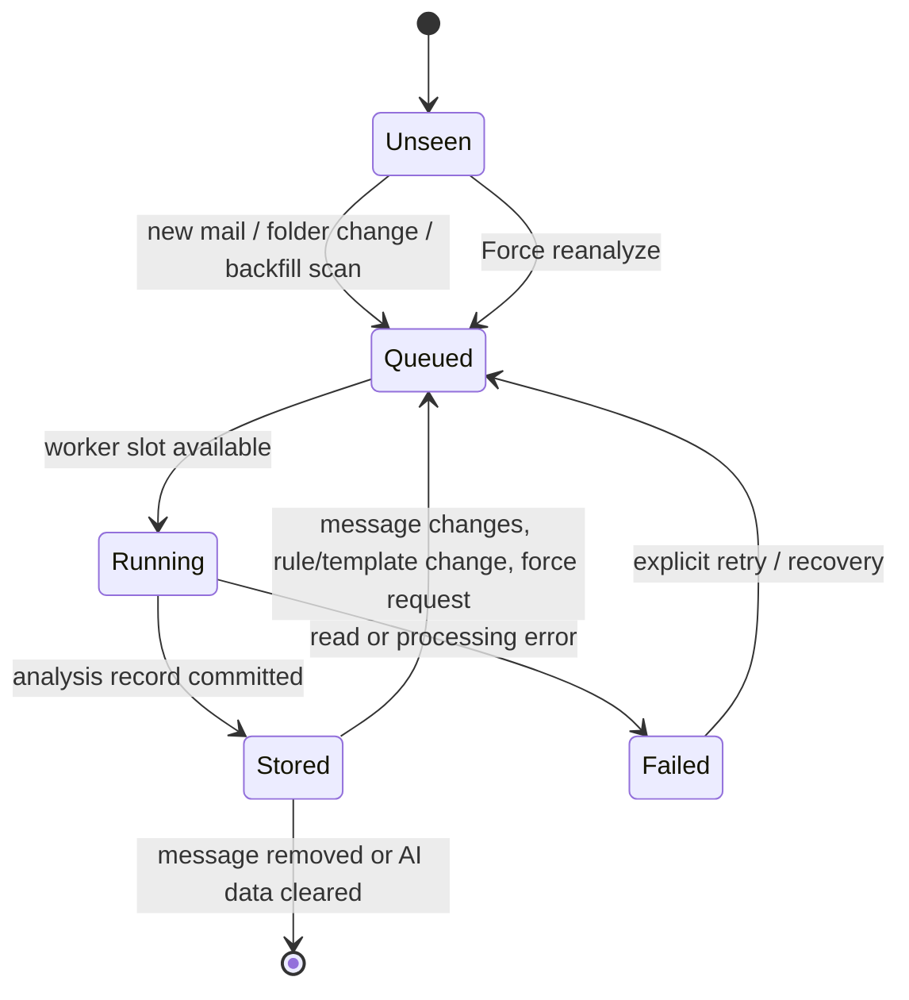

Requests originate from:

1. New messages arriving in a real mail folder.
2. Folder or message property changes.
3. A background backfill scanning existing headers.
4. A user pressing **Force reanalyze** for the selected scope.
5. Targeted artifact refreshes such as summaries, embeddings, templates or
   other analysis artifacts.

The queue deduplicates by stable message ID. A user-forced request promotes an
already queued background message so it is not stuck behind idle backfill
work. Background work can be paused, while explicit forced requests can remain
eligible.

### 3.2 Batches, workers and checkpoints

```text
queue → bounded worker batch → per-message analysis → in-memory record updates
      → row-level SQLite checkpoint → observer/UI notification → next batch
```

Important properties:

- Work is bounded by configured queue and batch limits.
- Multiple worker slots can run only up to the configured effective count.
- Completion updates message-phase state, progress counts and visible badges.
- Bulk persistence suppresses a write after every message. It checkpoints on a
  message-count threshold, a time threshold, errors, and session completion.
- The canonical storage uses SQLite WAL and changed-row transactions. This is
  the fix for the former monolithic JSON rewrite amplification problem.
- After an analysis batch, contextual-passage embedding backfill may be
  scheduled. It is coalesced and bounded rather than one request per message.

## 4. Normal per-message analysis in exact order

The implementation records timeline stages. The common full-artifact path is
shown below.

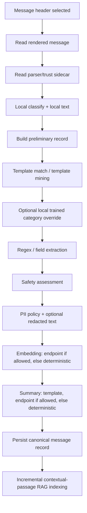

### 4.1 Step 1 — read the message and parser sidecar

`AIService` reads the locally available rendered message. Its record begins
with mail metadata including:

```json
{
  "accountKey": "server1",
  "folderURI": "mailbox://nobody@Local%20Folders/Human-Banking",
  "messageKey": 6,
  "messageId": "<mail-header-message-id-if-present>",
  "subject": "Debit Card transaction of INR 805 at Book Nook",
  "author": "Aster Bank Alerts <alerts@asterbank.test>",
  "date": 1787547300,
  "body": "bounded canonical body text",
  "analyzedAt": "2026-08-27T…Z"
}
```

The parser sidecar adds generated evidence about how the body was selected and
parsed:

- canonical-body source and body information;
- MIME/header parse flags;
- normalized header forms;
- parser/trust pipeline output;
- immutable evidence, MIME summary and attachment manifest where available.

This stage does not let email text influence Thunderbird instructions. Mail is
untrusted data throughout later prompting too.

### 4.2 Step 2 — local classification, tags and baseline summary

`AIClassifier` normalizes text, removes common boilerplate such as unsubscribe
lines, evaluates category and tag rules, and creates a compact deterministic
summary from subject, relevant sentences, category and extracted signals.

Illustrative category inputs:

| Email text fragment | Typical local category signal |
|---|---|
| `payment`, `bank`, `invoice`, `receipt` | finance |
| `job alert`, `open roles`, `hiring now` | jobs |
| `GitHub`, `pull request`, `build failed` | developer-update |
| `sale`, `discount`, `coupon` | promotion |
| `password`, `login`, `2fa` | security |

Illustrative tag inputs include `AI:Needs Reply`, `AI:Important`,
`AI:Receipt`, `AI:Newsletter`, `AI:Follow Up`, `AI:Suspicious`, and
`AI:Waiting`.

The result records category, confidence/reasons where known, suggested tags,
actions, priority, risk, local text and local summary. A matched user template
can supply a summary or override category according to template policy.

### 4.3 Step 3 — template and trained-classifier handling

Templates are repeated-mail patterns. A matching template can provide:

- a template family and slots;
- a predetermined category;
- a summary format;
- additional extracted values.

After a template match, the optional locally trained token-statistics
classifier may supply a category. Template policy wins unless the learned
classifier has the allowed confidence for that configuration. Both the source
and reasoning are recorded so the UI/debug trace can disclose which path won.

### 4.4 Step 4 — deterministic entity extraction

Extraction is field recognition, not generative understanding. It merges the
base classifier entities with transaction-specific rule results and template
entities.

Typical field groups are:

```text
dates                 amounts              invoiceNumbers
orderNumbers          trackingNumbers      links
emailAddresses        questions            tasks
transactionIds        referenceIds         upiIds
merchants             banks                statuses
```

For a bank message, rules recognise patterns such as:

```text
INR 805.00                           → amount
Reference: TXN-HC-100005             → reference ID
TXN-HC-100005                        → transaction ID
24 Aug 2026                          → date
debited                              → status
```

The merchant/bank patterns are intentionally conservative. A field absent
from rule output is not proof it is absent from the original email; it simply
means this local extractor did not reliably recognize it. The Assistant can
still use the bounded source passage when answering.

An optional endpoint JSON extractor exists for selected transaction workflows,
but deterministic extraction is the default local path described here.

### 4.5 Step 5 — safety and PII

Safety assessment consumes canonical parsing artifacts and analysis rather
than trusting a model to decide. It can record security evidence, risk flags
and other message-derived signals.

PII is evaluated by deterministic local rules. Built-in patterns include:

| Rule | Example detected form | Default severity |
|---|---|---:|
| Email | `name@example.test` | medium |
| Phone | international/local phone-shaped number | medium |
| UPI | `person@upi` | high |
| PAN | Indian PAN-shaped token | high |
| Aadhaar | 12-digit Aadhaar-shaped token | critical |
| API key | `sk_…`, `pk_…`, `rk_…` token | critical |
| JWT | three-part `eyJ…` token | critical |
| Payment card | 13–19 digit card-shaped token, Luhn checked | critical |

The PII stage may create:

```json
{
  "localRawText": "local canonical text",
  "redactedText": "text with policy redactions",
  "externalSafeText": "the policy-safe form for endpoint work",
  "piiDecision": "allow | redact | block | …",
  "piiSensitivity": "low | medium | high | critical",
  "piiRuleIds": ["email", "card"]
}
```

Local analysis is allowed to inspect its local text under the incoming policy.
Before endpoint work, the external-AI policy decides whether the original,
redacted, or no text can leave Thunderbird. Metadata-only traces also avoid
retaining raw bodies or credentials.

### 4.6 Step 6 — embeddings

The embedding input is policy-safe text: redacted text when required, otherwise
canonical/local analysis text.

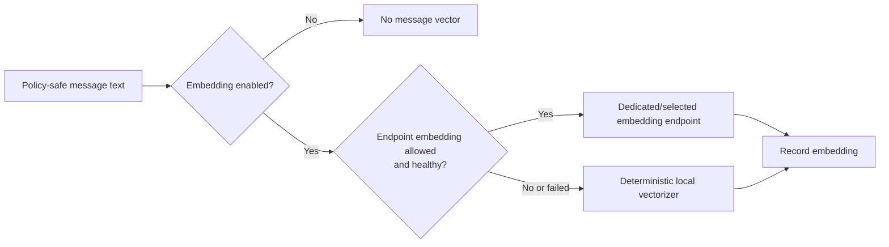

Endpoint embeddings require both endpoint-first embedding mode and background
endpoint permission. Failure falls back to the deterministic local vectorizer.
Contextual RAG passages always receive a local passage embedding immediately;
an optional dedicated endpoint embedding backfill can later upgrade passage
vectors when properly configured.

### 4.7 Step 7 — summary

Summary precedence is:

```text
template summary
    → endpoint summary, if endpoint-first and background endpoint work allowed
        → deterministic local summary
            → sender + subject fallback
```

Endpoint summaries use only `externalSafeText` / redacted text / policy-safe
fallback text, never an unrestricted raw-message copy. With the current
profile setting `mail.ai.endpoint.background=false`, this endpoint summary
stage is disabled and deterministic local summaries are used.

### 4.8 Step 8 — persist and publish

The completed record contains message metadata, local text, summary, category,
entities, security assessment, PII decision, vector, templates, timeline
stages and analysis version. `AIStorage.setMessage()` marks the row changed;
SQLite writes only changed data during its next bounded transaction.

Observers update:

- AI Assistant status and processing counters;
- message-list badges/phase markers;
- message hover/sidecar details;
- scope overview and RAG index generation;
- timeline/debug views.

## 5. Contextual RAG indexing

### 5.1 Why passages, not one vector per email

An email can be far longer than the useful answer. Indexing only one whole-mail
vector makes a sentence near the end compete with boilerplate and unrelated
content. This implementation creates **contextual child passages**.

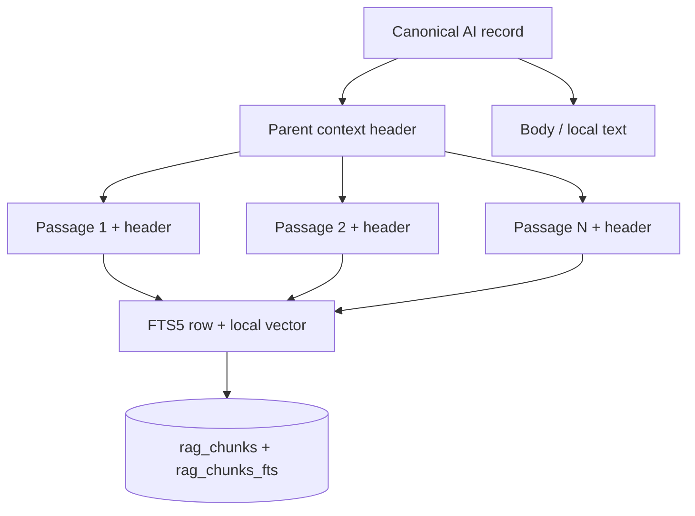

The header gives a passage its parent identity and useful retrieval context,
such as subject, sender, date, category and structured entities. Each indexed
chunk retains:

| Field | Why it exists |
|---|---|
| `chunk_id`, `message_id`, `chunk_index` | Stable passage and parent identity |
| `account_key`, `folder_uri`, `date_ms` | Scope filtering before retrieval |
| `chunk_text` | Contextual lexical-search text |
| `passage_text` | The actual quoted/retrieved passage |
| `start_offset`, `end_offset`, `source_field` | Exact provenance within the parent record |
| `context_schema_version`, `input_hash` | Safe rebuild/compatibility decisions |
| `embedding_model`, `embedding_dimension`, `embedding_json` | Dense retrieval compatibility |
| `redaction_policy` | Disclosure and policy correctness |

The index has:

```sql
rag_records(message_id, account_key, folder_uri, date_ms, record_json, ...)
rag_chunks(chunk_id, message_id, chunk_index, chunk_text, passage_text, ...)
rag_chunks_fts(chunk_id UNINDEXED, message_id UNINDEXED, chunk_text) USING fts5
```

The SQLite FTS5 virtual table is used when available. If unavailable, the
implementation has a bounded lexical fallback; it does not make a failed FTS5
setup look like semantic retrieval.

### 5.2 Incremental and rebuild behavior

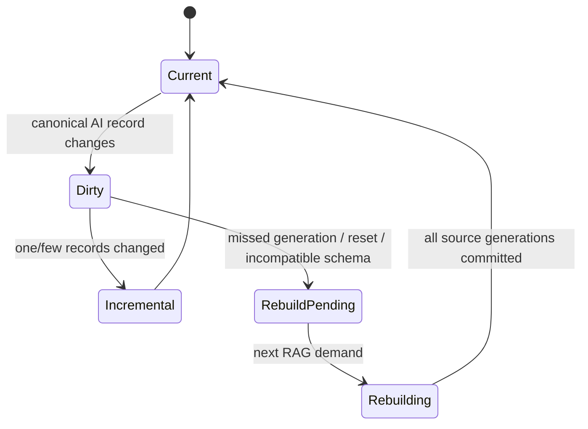

The RAG index is disposable. Canonical records maintain a monotonically
increasing record generation. The index records the generation it has covered.
Small changes replace the affected record/chunks; resets or missed generations
trigger a lazy, bounded rebuild. An interrupted rebuild does not claim it is
current until its generation commits.

### 5.3 Retrieval channels

For a normal non-exact query, Thunderbird searches several complementary local
signals:

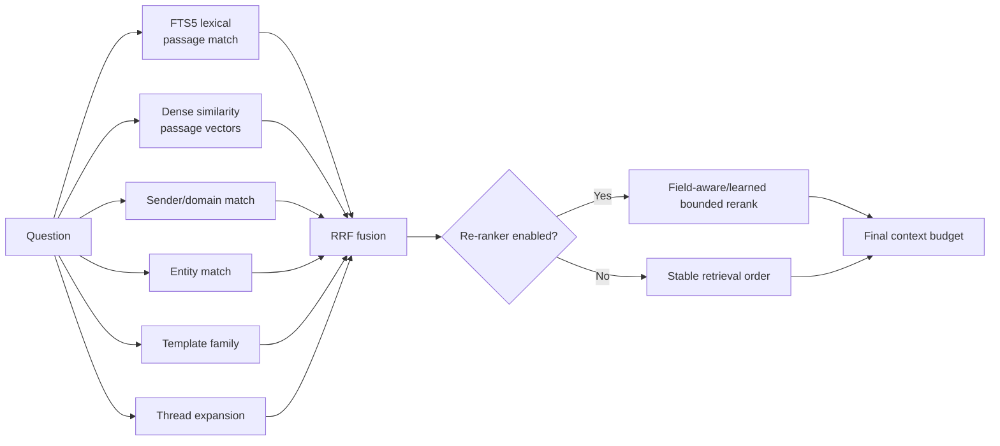

Lexical and dense parent candidates are deduplicated by parent message ID and
fused by reciprocal-rank fusion. The default reciprocal-rank constant is 60.
Only a bounded candidate set is reranked. Re-ranking failure falls back to
deterministic ordering; it never widens the scope.

### 5.4 Exact and structured constraints come first

For a query containing a transaction/reference ID, amount or date constraint,
the planner changes route:

```text
has identifier / hard constraint
  → exact/structured index search
  → verify each candidate against constraints
  → lock authoritative records
  → do not let semantic/re-ranker ordering replace them
```

This is why the question `Find transaction TXN-HC-100005` returns one exact
record rather than a plausible but different Book Nook transaction. The debug
route is `exact_lookup` and the ranking mode becomes `exact-locked`.

### 5.5 Adaptive query planning

For unconstrained questions, the planner may create up to three bounded query
facets. It does not expand scope. It can stop after a plan-complete condition
or search adjacent wording/facets when one literal search is not sufficient.

Examples:

| User question | Planner behavior |
|---|---|
| `TXN-HC-100005` | Exact identifier lane; no adaptive expansion needed |
| `Book Nook payment for 805 on 24 Aug` | Structured constraints; exact/constraint lane |
| `What did the launch thread decide?` | Lexical/dense query plus thread-aware evidence |
| `What needs attention this week?` | Bounded local signals, date/action facets, then compact evidence |

## 6. Scope is a security boundary

The selected scope is immutable for a turn. It is applied to both canonical
record lookup and RAG queries before ranking.

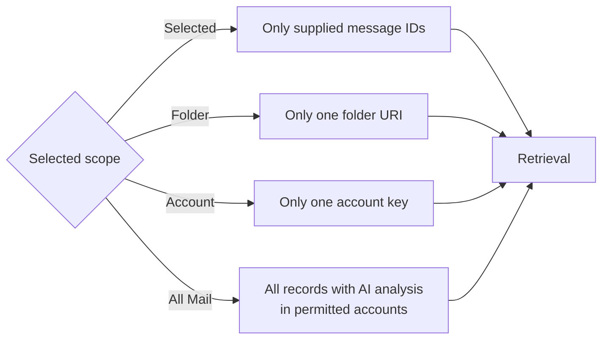

Scope behavior in practical terms:

| Scope | Normal RAG candidates | Exhaustive digest headers |
|---|---|---|
| Selected | The selected AI records only | Selected message headers only |
| Folder | AI records for the current folder | Actual headers in that folder |
| Account | AI records for the account | Actual headers in that account |
| All Mail | All AI records in allowed accounts | Actual headers in the selected all-mail scope, including mail without AI records |

This difference is intentional. Normal RAG is a search over existing AI
records. An exhaustive digest freezes and enumerates actual message headers so
it can report coverage honestly even for messages not previously analyzed.

## 7. Assistant answer pipeline

### 7.1 Normal question with Direct RAG off

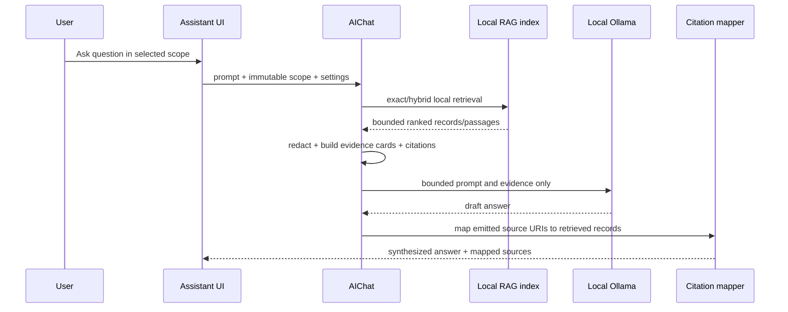

The Assistant sends no full mailbox dump. It builds a context budget with a
record/item limit, byte/token estimates, redaction flag, included/excluded
items and truncation information. This is visible in Debug as
`contextBudget`.

Evidence cards include bounded fields such as:

```json
{
  "messageId": "mailbox://…/Human-Banking#6",
  "subject": "Debit Card transaction of INR 805 at Book Nook",
  "author": "Aster Bank Alerts <alerts@asterbank.test>",
  "summary": "INR 805.00 was debited …",
  "matchedPassage": "…24 Aug 2026 at Book Nook…",
  "entities": {
    "amounts": ["INR 805.00"],
    "referenceIds": ["Reference: TXN-HC-100005"]
  },
  "citation": {"messageId": "mailbox://…#6", "chunkId": "…"}
}
```

The citation mapper preserves source URIs that refer to retrieved records. If
the answer emits none, the Sources panel shows the bounded retrieved context
without claiming that it verifies individual sentences. It does not judge,
reject, repair, or rewrite answer claims. The synthesis
prompt asks the endpoint to say “not found in retrieved evidence” when a
requested fact is absent, but that remains endpoint output rather than an
independent verification verdict.

### 7.2 Direct RAG on

With Direct RAG enabled, the endpoint synthesis step is skipped.

```text
scope → local retrieval → evidence cards → deterministic grounded rendering
```

This is useful for auditing and exact lookups. The result may be less fluent,
but it cannot be altered by an endpoint model. Debug reports `route: direct-rag`
or an exact/structured local route.

### 7.3 A factual example: exact transaction lookup

Question:

```text
Find transaction TXN-HC-100005. Return its subject, amount, date,
merchant, transaction reference and source message.
```

Expected internal path:

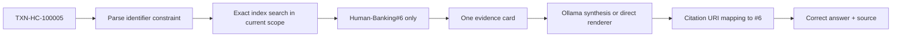

The exact record remains authoritative even if other Book Nook messages have
stronger semantic similarity. This exact-match lock is essential for finance,
orders, tickets and IDs.

## 8. “All Mail” has two very different paths

### 8.1 All Mail RAG question

For a question such as “Find the Aster Bank Book Nook transaction,” All Mail
means **all eligible AI records are candidates**. It does not mean every raw
email body is placed in an endpoint request.

```text
6,000 AI records
  → local exact/FTS5/dense/entity retrieval
  → perhaps 8 final evidence records
  → one bounded endpoint prompt
```

The UI/debug view can truthfully say `8 retrieved / 6000 examined`; that means
the local index considered the scope and selected eight evidence records, not
that Ollama read 6,000 emails.

### 8.2 All Mail exhaustive digest

For a request that explicitly asks to summarize/overview/digest a scope with
Direct RAG off, Thunderbird can run the exhaustive mailbox-digest workflow.

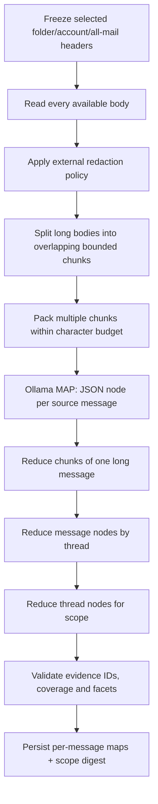

The map prompt asks for JSON only, one item per supplied ID. It asks Ollama to
return summary, category, themes, actions, deadlines, decisions, risks and
notable facts. Every mail value remains untrusted data; it is never allowed to
change the system instructions.

Long bodies are capped defensively (8 MiB of characters per body) and split
into overlapping chunks. The digest does not pretend that an unreadable,
unavailable, over-cap or failed body was summarized. It reports coverage:

```text
totalMessages, readMessages, summarizedMessages, cachedMessages,
skippedMessages, unavailableMessages, failedMessages, truncatedMessages
```

The map/reduce job has a private/loopback Ollama requirement. It uses a bounded
endpoint concurrency (normally at least one and at most the configured cap),
captures latency/retry/failure counters, checkpoints message maps, and can
resume after a pause without repeating completed work.

An unchanged message body/source/model reuses its saved map. An unchanged
scope fingerprint/source/model reuses its completed digest. A changed message,
model or source causes the appropriate stale cache to be rebuilt.

## 9. Complete multi-email dry run

This synthetic mini-mailbox is small enough to follow manually but exercises
the same paths as the 6,000-message corpus.

### 9.1 Input mailbox

| ID | Folder | Subject | Body fact relevant to later questions |
|---|---|---|---|
| B-6 | Human-Banking | `Debit Card transaction of INR 805 at Book Nook` | `INR 805.00 … 24 Aug 2026 … Reference: TXN-HC-100005` |
| B-474 | Human-Banking | `Debit Card transaction of INR 9,421 at Book Nook` | Different amount/date/reference; a plausible distractor |
| O-1241 | Human-Office | `Atlas Checkout — daily stand-up` | Launch dashboard, support tickets and a 17 Sep checkpoint |
| F-334 | Human-Family | `Sunday dinner plan` | Family dinner suggestion and no work deadline |
| M-92 | Human-Marketing | `DailyDish: 15% off meal plans` | Coupon `HELLO15`, marketing text |
| L-88 | Human-Office | `Release retrospective` | A long message; decision appears near the final paragraphs |

### 9.2 Normal local analysis of B-6

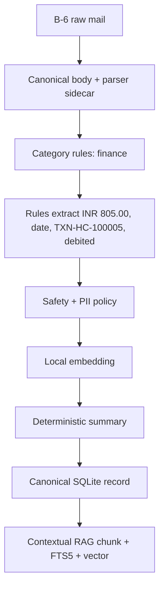

Illustrative resulting fields:

```json
{
  "messageId": "mailbox://…/Human-Banking#6",
  "category": "finance",
  "summary": "INR 805.00 was debited from account ending 1842 on 24 Aug 2026 at Book Nook using debit card.",
  "extractedEntities": {
    "amounts": ["INR 805.00"],
    "dates": ["24 Aug 2026"],
    "transactionIds": ["TXN-HC-100005"],
    "referenceIds": ["Reference: TXN-HC-100005"],
    "statuses": ["debited"]
  },
  "summarySource": "local",
  "providerState": "local"
}
```

The local pipeline similarly analyses every other message. B-474 creates a
separate finance record, O-1241 likely becomes work/developer-update with a
date/action signal, F-334 becomes personal, M-92 becomes promotion, and L-88
is split into multiple contextual passages so its late decision remains
retrievable.

### 9.3 Exact RAG dry run

User scope: **Human-Banking folder**.

User asks:

```text
Find TXN-HC-100005 and give its amount.
```

| Step | State |
|---|---|
| Scope filter | 1,500 banking records are eligible; Office/Family/Marketing are excluded |
| Constraint parse | Identifier list contains `TXN-HC-100005` |
| Exact search | Finds B-6 in record entities/passage text |
| Verification | B-6 contains the identifier; B-474 does not |
| Exact lock | B-6 becomes the sole authoritative selection |
| Evidence budget | One card, one source, bounded text |
| Direct RAG | Locally renders the amount/source; no endpoint call |
| Endpoint mode | Local Ollama receives only B-6 card, then must cite B-6 |

Correct result:

```text
Amount: INR 805.00
Source: Human-Banking#6
```

The number `INR 9,421` from B-474 must never replace the correct result just
because both messages mention Book Nook.

### 9.4 Semantic/paraphrase dry run

User asks:

```text
Which debit-card payment at Book Nook was for 805 rupees on 24 August 2026?
```

This question has hard amount/date constraints but no transaction ID.

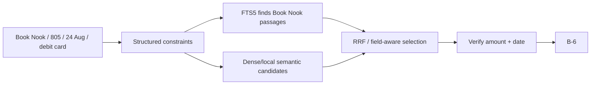

Several Book Nook records may appear in the source list as distractors, but the
answer must pick B-6 because it satisfies the amount and date together.

### 9.5 Scope-isolation dry run

User selects only five Office messages and asks for `TXN-HC-100005`.

```text
selected message IDs only
  → 5 records examined
  → 0 banking candidates in scope
  → no B-6 evidence card
  → evidence-bound “not found / insufficient evidence” answer
```

The system must not silently broaden to All Mail. Switching scope to Folder or
All Mail and submitting a new turn permits B-6 retrieval again.

### 9.6 Long-message passage dry run

L-88 has a 12,000-character body. The important release decision appears near
the end:

```text
… earlier retrospective material …
Decision: postpone rollout until 17 Sep after the payment API fix.
```

The index emits contextual passages, for example:

```text
L-88:chunk:0  [subject/sender/date header + body offsets 0…N]
L-88:chunk:1  [same context header + overlapping body offsets …]
L-88:chunk:2  [same context header + “Decision: postpone … 17 Sep …”]
```

When the user asks “What did the release retrospective decide?”, the FTS5/dense
match should select `L-88:chunk:2`, while the citation still identifies the
parent mail. Thunderbird sends that bounded relevant passage rather than the
whole 12,000-character mail.

### 9.7 Exhaustive folder-digest dry run

User chooses **Human-Banking** and requests:

```text
Create an exhaustive digest of this folder: categories, notable activity,
actions, deadlines, risks and representative source messages.
```

```mermaid
sequenceDiagram
  participant UI as Assistant UI
  participant S as AIService digest job
  participant DB as Local SQLite checkpoint
  participant O as Local Ollama

  UI->>S: start scope=frozen Human-Banking
  S->>S: enumerate 1,500 actual headers
  loop every locally readable body
    S->>S: redact if policy requires; split/pack bounded chunks
    S->>O: MAP JSON request for pack
    O-->>S: one structured node per mail
    S->>DB: checkpoint map nodes periodically
  end
  S->>O: reduce long-message nodes
  S->>O: reduce thread nodes
  S->>O: reduce folder nodes to executive digest
  S->>DB: persist scope digest + coverage + citations
  S-->>UI: digest, 1500/1500 coverage, progress/latency stats
```

If 1,490 messages map successfully, five have unavailable bodies and five
fail, the final digest must state partial coverage rather than claiming it
summarized every message. Its cached result can still be useful, but its
coverage communicates the limitation.

## 10. Persistence, recovery and write behavior

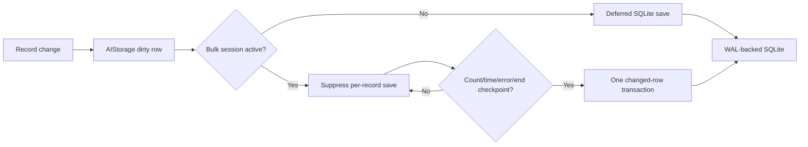

Canonical storage is initialized with SQLite WAL mode and normal synchronous
mode. It separates namespaces such as messages, digest message maps, digest
jobs, final digests, provider state, mining candidates and bounded global
sections. Legacy JSON can be imported in bounded transactions; an interrupted
import preserves the older valid source for safe retry.

For normal or bulk processing, storage tracks:

- scheduled/suppressed write count;
- bulk active session count;
- pending changed items;
- checkpoint count, reason and timestamp;
- persistent message/digest job state.

This design avoids the former behavior where a large `mail-intelligence.json`
file could be serialized every few seconds during high-volume analysis.

## 11. Privacy, safety and action boundaries

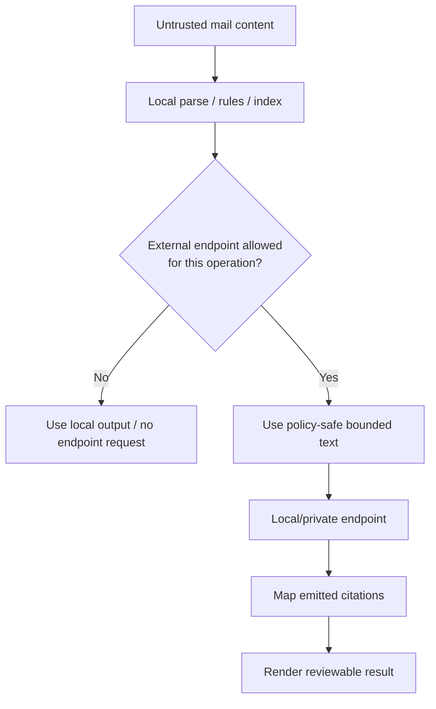

Security invariants:

1. Email text is data, never instructions. Prompts explicitly reject commands
   embedded in email bodies.
2. Scope cannot expand during retrieval, reranking, synthesis or tool use.
3. Exact constraints beat semantic plausibility.
4. Endpoint answers expose only citations that map to retrieved records.
5. There is no hidden post-answer judge, repair, or forced-abstention pass.
6. Assistant/workflow output is reviewable. Drafting, moving, tagging,
   filtering, deleting, sending or calendar actions require separate
   Thunderbird confirmation paths.
7. A loopback Ollama endpoint keeps endpoint traffic on the machine, but it is
   still a separate process that receives the permitted bounded text.
8. Public endpoints require explicit cloud permission; non-loopback digest
   execution is rejected by the exhaustive-digest path.
9. Metadata-only traces do not retain raw message bodies, unredacted evidence,
   API keys, bearer tokens or credentials.

## 12. What users see and how to debug it

| UI element | Meaning |
|---|---|
| `Analysis X/Y` | Canonical AI records completed for the current UI scope |
| `RAG X/Y` | Messages/passages represented in the usable local RAG index for the scope |
| Direct RAG On/Off | Whether the answer is rendered locally or synthesized through the Assistant endpoint |
| Re-ranking On/Off | Whether bounded retrieval candidates receive optional reranking |
| `0 queued`, worker status | Analysis queue health, not endpoint-context size |
| Progress bar after force reanalyze | Requested analysis job progress; it is distinct from an exhaustive digest job |
| Source cards / Open source | Parent message provenance for answer evidence |
| Show Debug | Route, scope, retrieval channels, context budget, endpoint attempts, and citation mapping |

Useful Debug fields include:

```text
route: exact_lookup | transaction_lookup | direct-rag | mailbox_digest | …
scopeMode: selected | folder | account | all
contextBudget: included/excluded records, bytes, tokens, redaction, truncation
candidateSources: exact, semantic, lexical, sender, entities, templates, thread
citationGrounding: source-URI mapping diagnostics only; no verification verdict or response gating
citations: message IDs and, when available, passage/chunk identity
toolExecution: bounded local RAG calls for mailbox-summary synthesis
```

### 12.1 Reading common outcomes

| Outcome | Correct interpretation |
|---|---|
| `Grounded evidence only` | Direct RAG rendered local evidence; no endpoint synthesis |
| `LLM synthesis from retrieved mail` | Endpoint answered using bounded local evidence |
| `Exact match locked` | Identifier/constraint validation made a record authoritative |
| `not found in retrieved evidence` | The endpoint chose to say it did not find a fact; this is not an independent verification verdict |
| `X retrieved / Y examined` | Local retrieval considered scope records and selected X; it does not mean X/Y raw emails were sent to Ollama |
| `partial digest` | Some headers/bodies/chunks failed, were unavailable, skipped or capped; use reported coverage |

## 13. Configuration examples

### 13.1 Privacy-first local indexing plus local Ollama chat

```text
mail.ai.enabled = true
Assistant source = Local Ollama AI-5000 / llama3.2
mail.ai.endpoint.background = false
mail.ai.summaries.mode = endpoint-first
mail.ai.embeddings.mode = endpoint-first
```

Result:

- Background summary/embedding endpoint calls are disabled by the background
  gate, so local deterministic work builds normal analysis records and RAG.
- Direct RAG remains fully usable offline from Ollama.
- Assistant synthesis can call local Ollama only after bounded local retrieval.
- An explicit exhaustive digest can call the private Ollama source.

### 13.2 Folder reanalysis using Ollama summaries

```text
mail.ai.endpoint.background = true
mail.ai.summaries.mode = endpoint-first
scope = current folder
artifact = summaries or all
Force reanalyze
```

Result:

- Each policy-safe message can be submitted to the configured summary endpoint.
- Thunderbird retains local extraction/PII/security/indexing.
- A failed or disabled endpoint summary falls back to deterministic summary.
- This is currently a background setting; it is not yet a dedicated one-time
  “use Ollama for this folder only” product control.

### 13.3 Exhaustive folder digest

```text
scope = current folder
Direct RAG = off
Assistant workflow = Summarize scope
```

Result:

- The scope is frozen.
- Every locally available body is processed in bounded map/reduce chunks.
- Per-message maps, job checkpoints, coverage and final digest are persisted.
- The UI should show processing and later reuse a valid cached digest.

## 14. Performance characteristics and deliberate limits

| Area | Bound / behavior |
|---|---|
| Assistant evidence | Small bounded set; normal test configuration uses up to 8 final records |
| RAG candidate work | Scope-filtered before ranking; only bounded candidates are reranked |
| Passage storage | Bounded child chunks per message, each with provenance and a context header |
| Endpoint request | Bounded evidence/pack, never full mailbox text |
| Long digest body | Defensive per-body size ceiling; over-limit coverage is explicit |
| Endpoint concurrency | Configured cap, normally constrained to preserve UI responsiveness |
| Canonical writes | Changed rows and bulk checkpoints, SQLite WAL |
| RAG index | Rebuildable derived SQLite cache; lazy rebuild after generation mismatch |
| Trace history | Bounded; metadata mode protects raw mail content |

The performance suite exercises 100,000 generated AI records. It checks that
1,000 scattered updates use one bounded checkpoint rather than a full-store
rewrite, and separately measures cold index construction versus warm cached
scope-overview reads.

## 15. Manual verification matrix

| Test | Input | Expected proof |
|---|---|---|
| Exact RAG | `TXN-HC-100005` | Exact lock, B-6 source, INR 805, no substitute transaction |
| Endpoint synthesis | Same query, Direct RAG off | LLM answer retains exact values and citation B-6 |
| Hallucination resistance | Ask for absent manager/approval code | Explicit absence; no invented name/code |
| Semantic/paraphrase | `Book Nook … 805 … 24 Aug` | Correct B-6 despite no literal transaction ID |
| Scope isolation | Select unrelated Office mail, query B-6 | Zero banking evidence; no All Mail leakage |
| Re-ranking | Compare toggle on/off | Relevant record remains/selects higher; scope unchanged |
| Long passage | Ask about late text in long mail | Citation points to relevant child passage/parent message |
| Folder digest | Summarize scope | Monotonic progress, coverage, cached result and representative sources |
| Pause/resume | Pause digest mid-run, then resume | Completed maps reused; no full restart |
| PII policy | Known PII-shaped fixture | Correct redaction decision; no unredacted external payload in metadata trace |

## 16. Concise mental model

```text
Thunderbird first makes mail searchable and auditable locally.

RAG selects only evidence that is both relevant and inside the user’s scope.

Ollama is a bounded synthesizer or explicit map/reduce worker, not the
mailbox database, indexer, policy engine, or source of truth.

Every useful answer should be traceable back to message and passage evidence.
Every uncertainty should remain uncertainty rather than being filled with a
plausible model guess.
```

## 17. Related documents and source starting points

- [RAG modernization plan](RAG-Modernization-Plan.md)
- [Component overview](README.md)
- `AIService.sys.mjs`: per-message analysis, queueing and mailbox digest jobs
- `AIRAGIndex.sys.mjs`: contextual chunks, FTS5 and vector retrieval
- `AIChat.sys.mjs`: scopes, retrieval planner, endpoint synthesis and citation mapping
- `AIStorage.sys.mjs` / `AISQLiteStorage.sys.mjs`: persistence/checkpoints
- `AIClassifier.sys.mjs`, `AIExtractionRules.sys.mjs`, `AIPIIRules.sys.mjs`:
  deterministic local analysis
