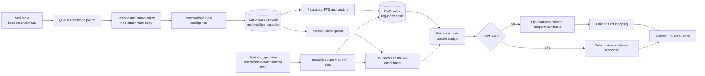
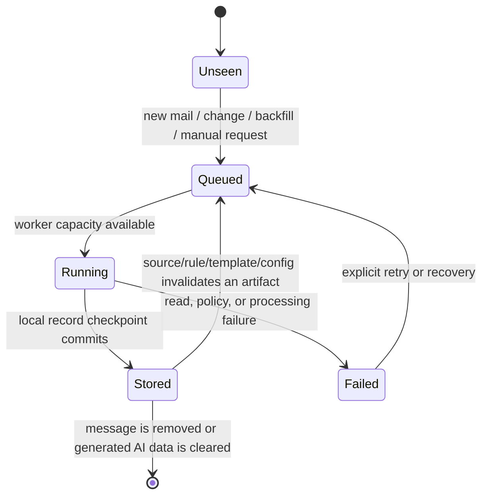

# Thunderbird AI Mail Pipeline and Evaluation Reference

This living technical reference explains how a message becomes local AI data,
how that data is used for retrieval and answers, when an Ollama endpoint is
involved, and what the current evaluations establish. It is for engineers and
advanced operators.

The companion [2026-09-04 evaluation record](AI-Evaluation-Run-2026-09-04.md)
is an immutable account of the test work from that session. It separates
completed results from an interrupted model-matrix smoke run. See the
[pipeline deep dive](AI-Mail-Pipeline-Deep-Dive.md) for source-level detail and
the [user guide and Assistant test](User-Guide-and-AI-Assistant-Test.md) for
the operational workflow.

## Guarantees and boundaries

- Original mail remains in Thunderbird's mail store. AI records, indexes,
  templates, endpoint artifacts, queues, and traces are generated
  profile-local data.
- Every mail body is untrusted input. It cannot alter Assistant instructions,
  broaden an immutable scope, or become a fact simply because a model repeats
  it.
- Normal analysis does not need a chat model. MIME parsing, canonical text,
  rules, PII policy, template mining, local summaries, scope enforcement, and
  citation mapping are Thunderbird work.
- An endpoint receives only policy-safe, bounded derived content when endpoint
  work is enabled. A normal Assistant RAG question never sends a mailbox dump
  to Ollama.
- A citation identifies a retrieved message. It is not an independent,
  sentence-level truth judgement of an endpoint answer.

## End-to-end flow



### 1. Intake and canonicalization

An incoming, selected, or backfill-queued message first has its MIME structure
parsed. The canonical body is derived from decoded non-attachment text.

1. Read headers, MIME parts, authentication/trust data, account, and folder.
2. Decode Base64, quoted-printable, charset, and multipart text where the part
   is message content rather than an attachment.
3. Select and normalize the canonical body while retaining bounded parser and
   trust diagnostics as sidecar data.
4. Optionally derive a local English representation for retrieval, without
   replacing the canonical source.
5. Keep attachment content outside the canonical mail-evidence boundary.

This makes encoded plain-text mail searchable while preventing attachment
markers from silently becoming cited mail-body facts.

### 2. Deterministic local intelligence

The completed canonical artifact runs through local stages. Each can be rebuilt
for an Assistant scope without deleting original mail.

| Stage | Output | Purpose |
| --- | --- | --- |
| Category and local summary | Category, tags, compact fallback summary | Fast UI and endpoint-independent fallback. |
| Extraction | IDs, amounts, dates, people, actions, risks, typed values | Exact lookup and source-grounded comparison. |
| PII and safety | Matches, redaction policy, security assessment | Explicit handling for sensitive and untrusted input. |
| Template mining | Drain-style structural observations and family membership | Repeated structure without an LLM. |
| Template/manual extraction | Matched fields, slots, category/summary hints | Reviewable extraction for known mail families. |
| Local vector and passages | Contextual chunks and fallback vectors | Retrieval without an embedding endpoint. |

The built-in classifier is rules/heuristics with optional user-trained Sparse
Naive Bayes data; it is not a bundled LLM. Private GLiNER entity and ModernBERT
intent adapters are bounded local hints for retrieval/routing. Their outputs
never become mail facts or citations.

### 3. Template mining

TemplateMiner runs automatically after canonical local analysis:

```text
canonical message
  -> normalized structural tokens
  -> Drain family observation
  -> bounded examples and match count
  -> reviewable suggestion after the promotion threshold
  -> optional manual template or extractor
```

Template membership is a retrieval and extraction feature. It does not make one
message's fields true for another; the original matching source still supplies
the evidence and citation.

### 4. Persistence, RAG, and GraphRAG

| Store | Contents | Rebuild rule |
| --- | --- | --- |
| `ai/mail-intelligence.sqlite` | Canonical AI records, queue/checkpoint state, templates, endpoint artifacts, traces, digest data | Source of truth for generated AI state; recreate by reanalyzing mail. |
| `ai/rag-index.sqlite` | FTS passages, contextual chunks, vectors, index generations, overview cache | Disposable derivative; rebuild from canonical AI records. |

RAG indexes policy-safe derived fields and contextual source passages. Query
planning combines exact identifiers and structured constraints with lexical,
semantic, sender, entity, thread, template, and scope candidates. Reranking may
improve ordering but cannot broaden scope.

GraphRAG adds source-linked nodes and edges for sender, thread, entity, date,
action, risk, template family, and explicit source relationships. It provides
candidate paths and retrieval hints; it does not establish uncited facts.
Endpoint graph enrichment, where enabled, is separately labelled and
non-authoritative.

## Optional endpoint work

### Model roles

One Ollama model can serve several chat roles, but an embedding-only model
cannot serve a chat role.

| Role | Required capability | Typical work |
| --- | --- | --- |
| Assistant | Chat completion | Bounded cited answer synthesis. |
| Background/Analysis/Summaries | Chat completion | Optional enrichment and summaries. |
| Embeddings | Ollama embedding route | Dense retrieval vectors. |
| Reranking | Compatible ranking/embedding capability | Candidate ordering only. |

For example, `bge-m3` belongs on `/api/embed`, not a chat-completions URL. A
chat probe saying “does not support chat” is a role/route configuration error,
not an embedding failure.

### Upgrade with Ollama

Upgrade is an opt-in background enrichment pass over an already completed
local record. It does not reparse original mail or overwrite deterministic
facts.

```mermaid
sequenceDiagram
  participant U as User or scheduler
  participant Q as Scoped upgrade queue
  participant L as Completed local record
  participant O as Ollama endpoint
  participant S as Local AI record

  U->>Q: Snapshot scope / visible-row priority
  Q->>L: Read policy-safe artifact
  L->>O: Bounded summary or embedding request
  O-->>Q: Endpoint artifact or failure
  Q->>S: Save labelled endpoint result; retain local result
  Q->>Q: Pause between configured batches or cancel
```

The scope UI exposes batch size, inter-batch delay, visible-first or
visible-only mode, progress, countdown, and cancellation. Failed endpoint work
retains local analysis. Changing embedding models requires a derived
index/vector rebuild, not mail deletion.

### Assistant turns and exhaustive summaries

For a normal question, Assistant freezes the selected, folder, account, or All
Mail scope before retrieval. It packs a small number of source cards within a
byte/token budget, then either returns a deterministic response with **Direct
RAG** or sends only that bounded evidence to the endpoint for synthesis.

An explicit whole-scope digest is different: it is a resumable map/reduce job
that reads eligible bodies, applies redaction, chunks long text, creates
per-message maps, reduces by thread/scope, validates IDs/coverage, and stores a
digest. It reports skipped, unavailable, failed, and truncated messages rather
than claiming coverage it does not have.

## Complete AI pipeline inventory

This table is the complete product-level inventory of AI pipeline lanes. It
includes every data-producing, retrieval, Assistant, and AI-adjacent safety
branch; it intentionally excludes unrelated Thunderbird mail transport and UI
features.

| Lane | Starts from | Produces | Endpoint use and failure behavior |
| --- | --- | --- | --- |
| Eligibility and request creation | New mail, folder/property change, background backfill, manual scope action, or artifact rebuild | Deduplicated message job with priority, target artifact, and phase state | None. A forced user request can promote a queued backfill item. |
| Queue and workers | Eligible jobs | Bounded batches, per-message progress, checkpoints, queue/phase counters | Local workers only. Pause stops background work; cancel stops requested work and pending wait timers. |
| MIME/canonical source | Rendered local message plus parser sidecar | Canonical non-attachment text, headers, MIME/trust/attachment diagnostics | None. Decode failures are recorded; they do not turn attachment text into canonical body evidence. |
| Local category/tag/summary | Canonical text and deterministic signals | Category, reasons, tags, actions, priority/risk, fallback summary | None. Sender/subject fallback remains available if a richer local summary is unavailable. |
| Templates and trained category | Normalized canonical text, saved templates, labeled training data | Template match/family/slots; optional Sparse Naive Bayes category hint | None. Drain observations are automatic; template policy has defined precedence over a learned category hint. |
| Structured extraction | Canonical text, classifier/template signals, regex rules | IDs, amounts, dates, orders, tracking, merchants, banks, tasks, links, statuses and other typed fields | Default is deterministic. An optional endpoint JSON extractor is limited to selected workflows and is never the source of a citation. |
| Safety and PII | Canonical text plus parser/trust data | Local security findings, PII matches/severity, redaction/block decision, policy-safe endpoint text | None for the decision. Endpoint requests use only policy-safe/redacted text when required. |
| Specialist hints | Bounded canonical text and a verified private loopback adapter | GLiNER entity spans and ModernBERT closed-set intent hints | Private local adapter only. Invalid manifest, runner, offsets, spans, or labels are rejected; hints never become facts. |
| Message embedding | Policy-safe message representation | Endpoint or deterministic message vector and model/provenance state | Dedicated embedding source when allowed/healthy; otherwise deterministic local fallback. |
| Summary enrichment | Template/local artifact | Template, endpoint, deterministic, or sender/subject summary | Endpoint-first only when background endpoint work is enabled; otherwise local fallback. |
| Canonical persistence | Completed local artifact | Row-level record, analysis version, timeline stages, queue/provider state | None. SQLite WAL/checkpoints commit changed rows; a failed batch cannot claim a committed record. |
| Contextual RAG indexing | Canonical AI record generation | Parent records, contextual passages, FTS rows, vectors, scope rollups | Local passage vectors immediately; optional endpoint passage-vector backfill. Missed/incompatible generations cause a bounded lazy rebuild. |
| GraphRAG | Stored source facts, entities, threads, templates, dates/actions/risks | Source-linked nodes, edges, communities/path candidates | Local-first. Optional endpoint graph hints are separately marked and cannot establish a fact. |
| Normal Assistant retrieval | Immutable Selected, Folder, Account, or All Mail scope and user question | Exact/structured or hybrid candidates, ranked source cards, citations, trace/context budget | Endpoint is optional and receives bounded cards only. Direct RAG skips it. |
| Assistant local tool loop | Endpoint request that needs bounded additional evidence | Mailbox search, graph, transaction, signal, timeline, workflow, contact, and calendar tool results | Ollama tool calls are bounded to four rounds, six calls, and 24 evidence records. Every tool remains scope locked. |
| Exhaustive scope digest | Explicit summary/overview request with Direct RAG off | Per-message maps, thread reductions, scope digest, coverage/failure counters | Private/loopback endpoint only; resumable map/reduce with bounded text/chunks and checkpoint reuse. |
| Upgrade with Ollama | Completed local records in a snapped scope | Labelled endpoint summary/vector artifact and per-batch state | Chat/embedding endpoint only. Failure preserves local records, local RAG, and source graph; pause/cancel prevents later batches. |
| Assistant workflows | Selected evidence and explicit user action | Reviewable reply, translation, task/calendar, organization, filter/folder or knowledge proposals | Optional bounded endpoint draft. No send, move, tag, task, calendar, or filter mutation occurs without Thunderbird confirmation. |
| Triage, timeline, hover and reader views | Cached AI records and queue/phase state | Summaries, categories, groups, markers, message phase rail and diagnostics | None required; cached local data remains viewable offline. |
| Data governance and reset | User-selected generated-data scope | Deleted/rebuilt AI records, indexes, traces, models, sources, or training data as selected | None. Reset never deletes original mail; attachment antivirus state is independently owned. |
| Read-only MCP | Authenticated local MCP client request | Bounded search, records, summaries, scope overview, triage, analytics, entities and traces | Loopback-only/read-only. Returned mail text is labelled untrusted; no mail mutation tools are exposed. |

### Queue lifecycle, priorities, and recovery



The queue deduplicates by stable message ID. It has separate priority for
interactive/forced work and background work, bounded worker/queue capacity,
and row-level checkpoints. Endpoint requests additionally have a bounded
endpoint lane, foreground reservation, timeout, cancellation, health/backoff,
and provider-pause state. An endpoint outage degrades only endpoint-dependent
work; it must not erase or block completed deterministic analysis.

### Exact order inside a full message analysis

```text
read rendered mail + parser/trust sidecar
  -> canonicalize/decode non-attachment text
  -> local classification, tags, baseline summary
  -> existing-template match and automatic Drain observation
  -> optional trained-category hint under template precedence policy
  -> regex/template/deterministic entity extraction
  -> local security assessment and PII decision
  -> policy-safe embedding (endpoint or deterministic fallback)
  -> template/endpoint/local summary selection
  -> persist canonical generated record and phase state
  -> incremental RAG passages/index and source-linked graph contribution
```

Each individual phase reports one of pending, queued, active, complete,
degraded, failed, cancelled, or stale/rebuild-needed state to the per-message
Timeline and aggregates it into Assistant and folder progress.

### Normal RAG, GraphRAG, and Assistant variants

| Question or mode | Local plan | Endpoint boundary |
| --- | --- | --- |
| Exact identifier, amount, or date | Parse hard constraints, search exact/structured fields, verify candidates, lock authoritative record(s) | Direct renderer can answer without endpoint; endpoint never replaces exact locked source values. |
| Normal semantic question | FTS passage, dense vectors, sender/domain, entity, template, thread, and scope candidates fused with reciprocal-rank fusion; optional bounded rerank | Up to eight selected cards fit the context budget before synthesis. |
| Relationship/path question | Normal candidates plus source-linked graph neighborhood/path/community candidates | Graph contributes retrieval paths only; answer claims still cite mail evidence. |
| All Mail RAG | Search analyzed AI records across eligible accounts, then select bounded evidence | Ollama sees selected cards, not every message. |
| Explicit All Mail/folder digest | Freeze actual headers, read/redact/chunk bodies, map/reduce, validate coverage | Bounded chunks/maps, resumable checkpoints, and explicit coverage counters. |
| Direct RAG | Render bounded local evidence/citations | No Assistant synthesis call. |
| Endpoint Assistant with local tools | Initial bounded evidence, then a scope-locked tool plan if required | Maximum four tool rounds, six calls, and 24 collected evidence records. |

The Assistant tool catalog is also bounded and read-only: mailbox overview,
local RAG search, document outline, graph overview/neighborhood/path/topic
communities, transaction lookup/sum/aggregation, mail aggregation/signals/
timeline, workflow proposal, contact search, calendar list, and calendar-item
search. Tool output is evidence, not executable instruction text.

### Invalidation, re-ingestion, migration, and reset map

| Change | Stale/rebuilt generated data | Preserved data |
| --- | --- | --- |
| New or changed message | Affected canonical record, phases, passages/vectors, rollups, and source graph contribution | Original mail and unaffected message records. |
| Saved template, template policy, regex rule, or classifier-training change | Affected template/category/extraction artifacts; reanalysis/rematching and downstream retrieval data as needed | Original mail and unrelated records. |
| Summary role/model/policy change | Applicable summary/endpoint artifact and summary-derived display data | Canonical text, deterministic extraction, PII/security policy, original mail. |
| Embedding/reranker model or policy change | Derived vectors, passage embeddings, RAG index/semantic coverage and ranking cache after reindex | Canonical record, source IDs, local facts, manual templates. |
| RAG schema/generation mismatch, index reset, or missed checkpoint | Disposable FTS/passages/vectors/rollups are lazily rebuilt from canonical records | `mail-intelligence.sqlite` canonical records. |
| Upgrade source/model or endpoint artifact changes | Upgrade artifact or digest cache with old source/model fingerprint | Completed local analysis and source graph. |
| Legacy JSON-to-SQLite migration | Generated state imports in bounded transactions; retained backup remains authoritative until import commits | Original mail, sources/credentials, legacy file during interruption. |
| AI data reset or message deletion | Only explicitly selected generated data; derived indexes/queues become stale or disappear | Original mail unless the user separately deletes it; antivirus verdicts remain independent. |

## AI-only limits and deliberate non-features

- No AI lane sends mail or silently changes folders, tags, filters, calendar,
  tasks, or message content. Workflow output is review-first.
- There is no bundled local chat/GGUF/ONNX helper runtime in the active
  pipeline. Chat and embedding roles use configured endpoints; specialist
  adapters require a separately verified private loopback runner.
- The attachment antivirus component is security-adjacent, not a language
  model or RAG source. It may affect security presentation but attachment text
  is not canonical mail evidence.
- Semantic coverage may be partial or unavailable while exact, lexical,
  sender, entity, template, and thread retrieval remains ready. “RAG ready”
  must not be interpreted as “every message has an endpoint vector.”

## Worked end-to-end examples

These are compact examples of state transitions, rather than a catalog of every
synthetic fixture. All values are illustrative fictional mail data. The actual
record/timeline UI uses the same stages and identifies their local, endpoint,
complete, degraded, or failed state.

### Example A: exact transaction lookup

Incoming mail:

```text
From: alerts@asterbank.test
Subject: Debit Card transaction of INR 805 at Book Nook

INR 805.00 was debited on 24 Aug 2026 at Book Nook.
Reference: TXN-HC-100005
```

| Phase | State after the phase |
| --- | --- |
| Ingest | The decoded non-attachment body becomes canonical source text; headers and parser/trust diagnostics are preserved as sidecar metadata. |
| Local intelligence | Category is finance-like; deterministic extraction finds `INR 805.00`, `24 Aug 2026`, `Book Nook`, and `TXN-HC-100005`; PII/security policy is recorded; a compact local summary is available. |
| RAG | A source-linked passage containing the reference is indexed in FTS and the vector index. The ID and typed amount/date are also searchable structured constraints. |
| GraphRAG | The message contributes source-linked entity/transaction/date relationships. These can help find candidates but do not replace the source passage. |
| Assistant query | `Find TXN-HC-100005 and give its amount and merchant. Cite it.` creates an exact-ID constraint. The matching message is selected before semantic Book Nook near-matches. |
| Answer | Direct RAG renders the evidence deterministically. Endpoint mode receives the one bounded evidence card and must cite this message. |

Expected answer facts are **INR 805.00**, **Book Nook**, and
**TXN-HC-100005**, with the source message. A different Book Nook transaction
cannot displace it merely because its wording is more semantically similar.

### Example B: proposal/final comparison with GraphRAG

Two office messages share a project key:

```text
Proposal: Atlas Checkout proposed for 15 Sep at 20:00 IST,
pending payments certification.

Final: Atlas Checkout approved for 18 Sep at 21:30 IST.
Meera owns the launch. Roll back if checkout errors exceed 2% for ten minutes.
```

| Phase | Proposal record | Final record |
| --- | --- | --- |
| Canonical/local | Proposal date, project, and provisional status are extracted. | Final date, owner, rollback condition, deadlines, and approval state are extracted. |
| RAG | Proposal passage can match `initial`, `proposed`, and project terms. | Final passage can match `approved`, owner, rollback, and project terms. |
| GraphRAG | Both records link to the same source-backed project/entity relationship. | The graph supplies a bounded relationship path back to both source records. |
| Assistant evidence | A comparison query requests both sides; the retrieval plan retains the proposal and final, rather than treating the final as an unrelated near-match. | Citations remain per-message; the graph itself supplies no uncited fact. |

Question:

```text
Compare the proposal and final approval for Atlas Checkout. Give the final
launch, owner, and rollback condition. Cite every bullet.
```

Expected answer: the final replaces 15 Sep 20:00 IST with **18 Sep 21:30 IST**,
names **Meera** as owner, states the **2% for ten consecutive minutes** rollback
condition, and cites the appropriate proposal and final messages. This is the
relationship behavior covered by the completed 5K retrieval test.

### Example C: encoded body and attachment boundary

Incoming mail contains a Base64-encoded text part with `Invoice INV-00004600`
and a PDF attachment whose filename contains a different invoice-like value.

1. MIME decoding makes `INV-00004600` part of the canonical non-attachment
   body.
2. The attachment remains attachment metadata/content; it is not appended to
   the canonical mail evidence.
3. Extraction and RAG index the decoded body identifier.
4. `What invoice identifier appears in decoded message <token>? Cite it.`
   retrieves the message and returns `INV-00004600`.

The expected answer must not cite a value seen only in the attachment. This
separates legitimate decoding from accidental attachment ingestion.

### Example D: recurring mail becomes a template family

Suppose several messages from one sender follow this structure:

```text
Subject: Your receipt for <merchant>
Amount: <currency> <amount>
Reference: <id>
```

Each canonical record is normalized before it enters TemplateMiner. Repeated
fixed text groups into a sender/account-partitioned Drain-style family; the
variable merchant, amount, and ID positions become structural variation rather
than a new family for every receipt. Once the promotion threshold is met, the
family appears as a reviewable suggestion with bounded examples and a match
count.

The family can improve retrieval for another receipt from the same structure.
It does not automatically create a trusted amount extractor. A user can load
the suggestion into a manual template, inspect conditions/slots, test it, and
save an explicit extraction rule. The original mail remains the citation target
for any extracted amount.

### Example E: what Upgrade with Ollama changes

Starting state for a completed local record:

```text
canonical body: retained
deterministic summary/extractions/safety: complete
RAG and source-linked graph contribution: complete
endpoint upgrade artifact: absent
```

For a scoped batch, Thunderbird sends only the policy-safe local artifact to a
configured chat or embedding endpoint. A successful chat upgrade adds a
separately labelled endpoint summary/enrichment artifact with its source/model
provenance. A successful embedding upgrade changes the derived vector used for
semantic retrieval. Neither operation overwrites canonical body text,
deterministic facts, local PII/security decisions, or source citations.

```text
local record complete
  -> queue batch 1
  -> endpoint request
  -> endpoint artifact complete, degraded, or failed
  -> wait configured pause
  -> next batch or cancellation
```

If the endpoint is unavailable or returns unusable output, the upgrade stage is
degraded/failed and the original local summary, RAG text, and graph source
contribution remain available. Upgrade-with-Ollama was deliberately *not* used
in the completed five-prompt Qwen Assistant result; the 5K upgrade/Assistant
matrix is the dedicated test for this distinction.

### Example F: selective reanalysis and re-ingestion

| User action or input change | What is regenerated | What remains intact |
| --- | --- | --- |
| **Reanalyze > Template mining** | Drain observations/family memberships and template suggestions for the current scope | Original mail, canonical text, existing summary, extraction, vectors, and endpoint artifacts. |
| **Reanalyze > Embeddings and RAG index** | Contextual passages, vectors, FTS/index generation and retrieval cache | Canonical record, local facts, manual templates, original mail. |
| **Reanalyze > Summaries** | Local/selected summary artifact | Original mail and independently derived extraction/security data. |
| **Reanalyze > All AI analysis** | All local derived artifacts and their downstream indexes | Original message and the immutable scope snapshot. |
| Source body, parser policy, or relevant analysis input changes | The affected canonical/local record becomes stale and is rebuilt; RAG/graph derivatives follow it | Unaffected messages and their generated records. |
| Embedding model changes | Derived endpoint/local vectors and RAG retrieval state after reindexing | Canonical messages, deterministic facts, templates, and source IDs. |

The Timeline makes these transitions visible for one message. Folder/Triage and
Assistant scope status aggregate them into complete, queued, active, failed,
and remaining counts. Reanalysis never edits the source email.

## Visibility and operator controls

| Surface | What it shows |
| --- | --- |
| Assistant scope status | Analysis/RAG coverage for the active scope, active job, and cancellation. |
| Folder AI status / Triage | Per-folder complete, queued, active, failed, and remaining counts. |
| Message-list state and hover summary | AI data for visible messages, including active/queued visual state. |
| Timeline tab | Per-message ingest, local intelligence, RAG/graph, upgrade, and Assistant phases. |
| Templates settings | Mined families, examples/counts, manual templates, and template tests. |
| Advanced runtime status | Cross-scope queue, endpoint health, worker state, lane reports, diagnostics. |

Use component-specific **Reanalyze** when only one artifact is stale:
summaries, embeddings/RAG index, template mining, regex extraction, security,
or all local analysis. “Clear” removes selected derived data only.

## Privacy and failure handling

- Background endpoint work requires local/private addresses unless public
  endpoint use is deliberately enabled.
- PII policy is applied before an endpoint request is built.
- Injection text remains untrusted mail content and cannot change Assistant
  instructions or scope.
- Cancellation, timeout, provider backoff, queue pause/resume, and restart
  recovery are explicit state transitions. Local records remain usable when an
  endpoint is unavailable.
- Default diagnostics should be redacted metadata. Never add raw private mail,
  endpoint payloads, credentials, or tokens to a report.

## Evaluation model and current evidence

Different tests prove different properties; no single green test promotes a
model or proves quality on real mail.

| Evaluation | Validates | Does not prove |
| --- | --- | --- |
| Unit/integration/browser suites | State, UI, persistence, scope and regressions | General answer quality on real mail. |
| Synthetic ingestion/RAG corpus | Parse, safety, PII, templates, RAG, graph, scope | Endpoint prose quality. |
| Frozen answer-model corpus | Model behavior on redacted evidence/citation prompts | Full Thunderbird retrieval behavior. |
| End-to-end synthetic Assistant run | Retrieval plus bounded endpoint synthesis | Private mailbox quality. |
| Upgrade × Assistant matrix | Interaction of upgrade state and Assistant model | Production readiness without human review. |

| Evidence | Status | Current conclusion |
| --- | --- | --- |
| AI backend/browser/performance correctness pass | Recorded baseline | A dated source-controlled report records passing backend, browser, lint, specialist-adapter and 100K gates. |
| Frozen 3B/8B/27B answer comparison | Recorded baseline | `qwen3:8b` passed its six-case gate at 1,024 completion tokens; other tested configurations did not clear every case. |
| 5K deterministic RAG and scope contracts | Completed session run | 300 contracts passed with zero final failures after proposal/final and source-ledger fixes. |
| 5K Qwen whole-mailbox prompts | Completed session run | Five bounded Assistant questions returned required final, transaction, decoded, and abstention outcomes. This was not an Upgrade-with-Ollama run. |
| 5K Upgrade × Assistant matrix | Implemented, not executed | Four ingestion states × three Assistant models × 130 prompts are defined; no full result exists. |
| 100-message matrix smoke | Interrupted, non-result | Endpoint work began, but an Assistant turn stalled before report output; a per-answer timeout was added afterward. |

The dated companion record gives exact commands, test contracts, defects found,
results, and known limitations.

## Reproducible entry points

Run from the source root. These fixtures are fictional; never point them at a
personal profile.

```sh
# Representative local corpus coverage.
./mach xpcshell-test comm/mail/components/ai/test/unit/test_ai_synthetic_corpus.js

# Full deterministic 10K ingestion/RAG/GraphRAG evaluation.
TB_AI_10K_EVAL=1 \
TB_AI_10K_EVAL_REPORT_PATH=/tmp/thunderbird-ai-synthetic-10k-report.json \
./mach xpcshell-test comm/mail/components/ai/test/unit/test_ai_synthetic_10k_evaluation.js

# Frozen answer-only comparison; no Thunderbird profile.
python3 comm/mail/components/ai/tools/evaluate_ollama_assistant_models.py \
  llama3.2:latest qwen3:8b qwen3.6:27b \
  --corpus comm/mail/components/ai/tools/data/model-answer-eval-v1.json \
  --warmup --timeout 120 --max-completion-tokens 1024 \
  --require-model-digest --output /tmp/thunderbird-ai-model-ab.json

# Full serial upgrade/Assistant matrix; may take many hours.
TB_AI_MODEL_MATRIX=1 \
TB_AI_MODEL_MATRIX_REPORT_PATH=/tmp/thunderbird-ai-model-matrix.json \
./mach xpcshell-test --timeout-factor 2880 \
  comm/mail/components/ai/test/unit/test_ai_synthetic_10k_evaluation.js
```

The matrix accepts a cell only when upgrades are complete, required facts meet
the configured threshold, and no safety, citation, scope, abstention, or
prompt-injection check fails. A timeout is visible failure data, not success.

## Outstanding evidence

1. Complete the full 5K Upgrade-with-Ollama × Assistant matrix and retain its
   JSON/Markdown reports outside the source tree.
2. Perform an authorized, human-reviewed small-folder real-mail evaluation
   without exporting raw mail.
3. Deliberately stress model-context exhaustion. RAG evidence-card bounds have
   been exercised, but context-window exhaustion needs its own test.
4. Compare embedding/reranking choices under the same end-to-end corpus before
   changing default role assignments.

Until then, these results are regression evidence and configuration guidance,
not a blanket quality or privacy claim.
